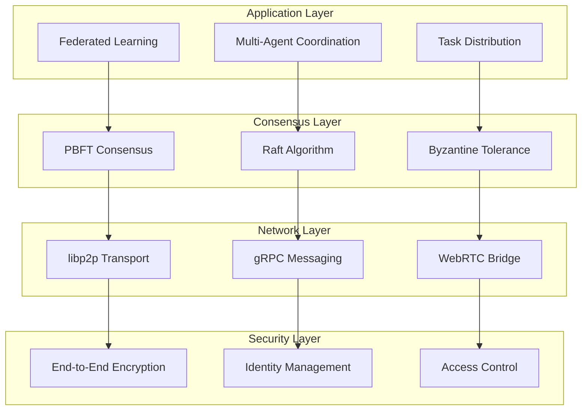
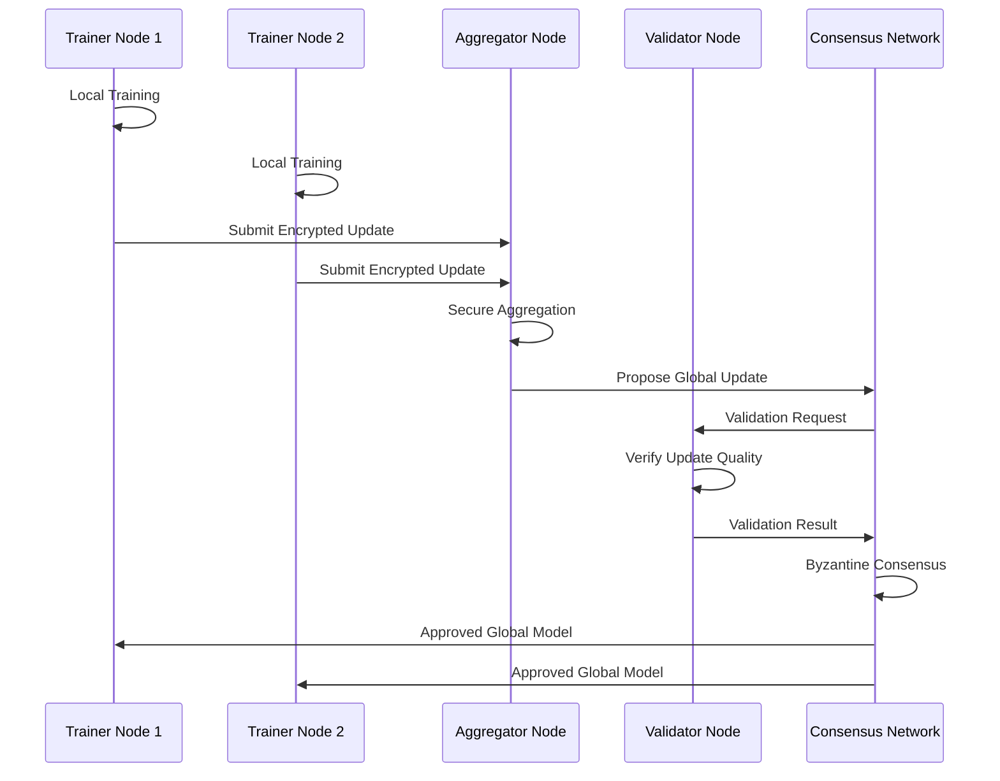
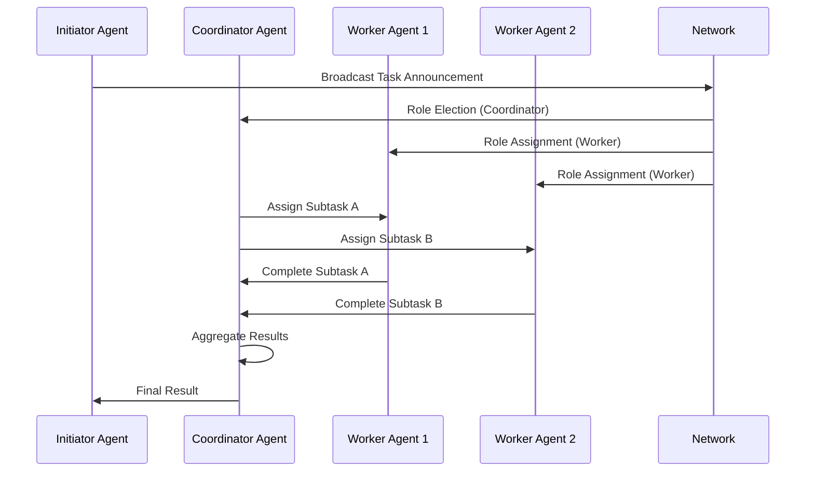
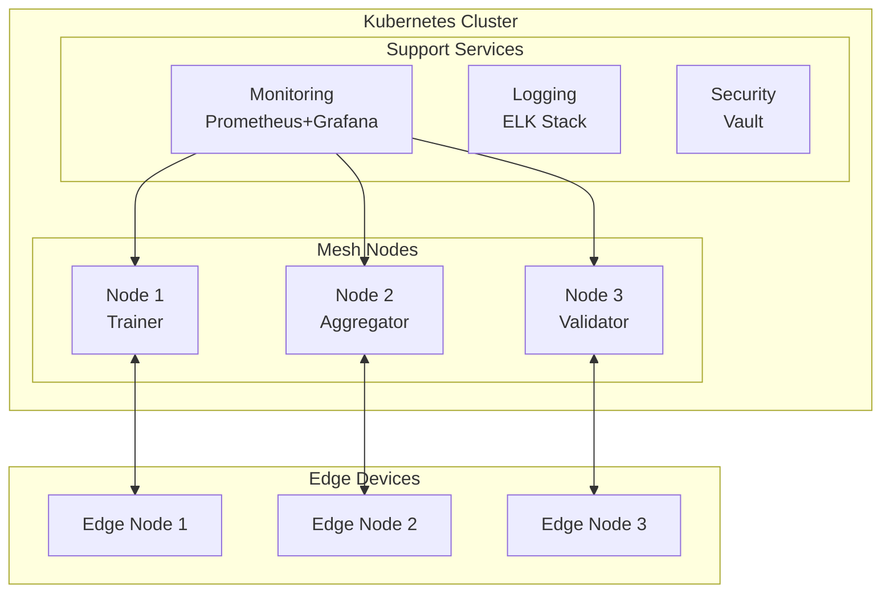
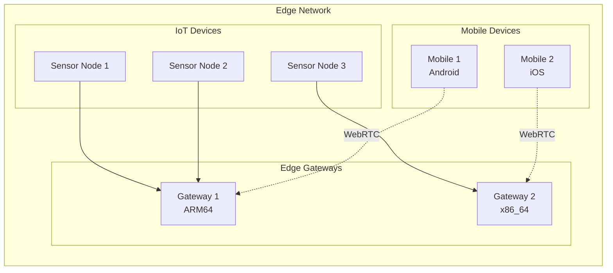
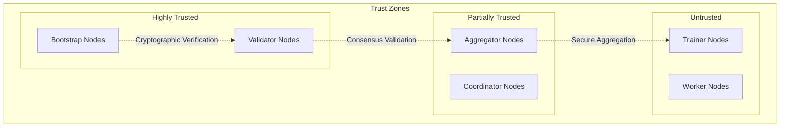

# System Architecture

## Overview
The Agent Mesh Federated Runtime is a distributed system architecture designed for decentralized federated learning and multi-agent coordination. The system eliminates single points of failure through a peer-to-peer mesh network with Byzantine fault tolerance.

## System Components

### Core Architecture

### Component Details

#### 1. Network Layer
- **libp2p Transport**: Handles P2P connectivity with multiple transport protocols
- **gRPC Messaging**: High-performance RPC for agent communication
- **WebRTC Bridge**: Browser and mobile device connectivity

#### 2. Consensus Layer
- **PBFT (Practical Byzantine Fault Tolerance)**: Main consensus for critical operations
- **Raft**: Leader election and log replication for coordination
- **Byzantine Tolerance**: Protection against malicious nodes

#### 3. Application Layer
- **Federated Learning Engine**: Distributed ML training coordination
- **Multi-Agent System**: Agent lifecycle and task management
- **Task Distribution**: Intelligent workload balancing

#### 4. Security Layer
- **Encryption**: Noise protocol and TLS 1.3 for secure channels
- **Identity Management**: X.509 certificates and key management
- **Access Control**: Role-based permissions and audit logging

## Data Flow Architecture

### Federated Learning Flow

### Agent Coordination Flow

## Deployment Architecture

### Cloud Deployment

### Edge Deployment

## Security Architecture

### Trust Model

### Cryptographic Architecture

- **Key Management**: Hierarchical deterministic (HD) key derivation
- **Encryption**: ChaCha20-Poly1305 for symmetric, ECDSA/Ed25519 for signatures
- **Consensus**: BLS signatures for efficient threshold schemes
- **Privacy**: Homomorphic encryption and secure multi-party computation

## Scalability Considerations

### Horizontal Scaling
- Dynamic node addition/removal without service interruption
- Sharded consensus for large networks (>1000 nodes)
- Hierarchical network topology for geographic distribution

### Vertical Scaling
- Adaptive resource allocation based on workload
- Memory-mapped storage for large model states
- CPU-optimized consensus algorithms

## Performance Characteristics

### Latency Targets
- P2P Message Delivery: <100ms (99th percentile)
- Consensus Finality: <5s for critical operations
- Model Update Propagation: <30s network-wide

### Throughput Targets
- Messages: 10,000 msg/sec per node
- Model Updates: 100 updates/round across 1000 nodes
- Task Distribution: 1,000 tasks/sec across mesh

### Resource Requirements
- **Minimum**: 1 CPU core, 512MB RAM, 1GB storage
- **Recommended**: 4 CPU cores, 4GB RAM, 10GB storage
- **High-Performance**: 16+ CPU cores, 32GB+ RAM, SSD storage

## Technology Stack

### Core Technologies
- **Language**: Python 3.9+ with asyncio
- **Networking**: libp2p, gRPC, WebRTC
- **Consensus**: Custom PBFT implementation
- **Cryptography**: NaCl, OpenSSL, BLS signatures
- **Storage**: SQLite (local), IPFS (distributed)

### Monitoring & Observability
- **Metrics**: Prometheus with custom exporters
- **Logging**: Structured JSON with correlation IDs
- **Tracing**: OpenTelemetry for distributed tracing
- **Dashboards**: Grafana with mesh-specific panels

### Development Tools
- **Testing**: pytest, Docker Compose integration tests
- **Documentation**: Sphinx with auto-generated API docs
- **CI/CD**: GitHub Actions with security scanning
- **Quality**: Black, isort, flake8, mypy