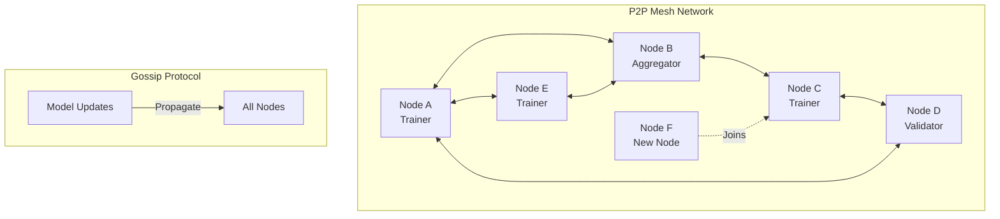

# Agent Mesh Federated Runtime

[](https://github.com/danieleschmidt/agent-mesh-federated-runtime/actions)
[](LICENSE)
[](https://www.python.org/downloads/)
[](https://github.com/danieleschmidt/agent-mesh-federated-runtime)
[](docs/INTEGRATION_GUIDE.md)
[](docs/security/)
[](https://sonarcloud.io/project/overview?id=agent-mesh-federated-runtime)

Decentralized peer-to-peer runtime for federated learning and multi-agent systems. No single point of failure, automatic role negotiation, and Byzantine fault tolerance. Scale from 2 to 10,000+ agents seamlessly.

## 🎯 Key Features

- **True P2P Architecture**: No central coordinator required
- **Dynamic Role Assignment**: Agents auto-negotiate trainer/aggregator/validator roles  
- **Fault Tolerance**: Byzantine consensus for robust federated learning
- **Multi-Protocol**: libp2p, gRPC, WebRTC for flexible connectivity
- **Privacy Preserving**: Secure aggregation and differential privacy built-in
- **Hot Swapping**: Add/remove agents without stopping training

## 📋 Table of Contents

- [Installation](#installation)
- [Quick Start](#quick-start)
- [Terragon SDLC](#terragon-sdlc)
- [Architecture](#architecture)
- [Federated Learning](#federated-learning)
- [Agent Coordination](#agent-coordination)
- [Network Protocols](#network-protocols)
- [Security & Privacy](#security--privacy)
- [Monitoring](#monitoring)
- [Deployment](#deployment)
- [API Reference](#api-reference)
- [Contributing](#contributing)

## 🚀 Installation

### From PyPI

```bash
pip install agent-mesh-federated-runtime
```

### From Source

```bash
git clone https://github.com/your-org/agent-mesh-federated-runtime
cd agent-mesh-federated-runtime
pip install -e ".[all]"
```

### Docker Swarm Mode

```bash
# Start a mesh node
docker run -d --name mesh-node-1 \
  -p 4001:4001 -p 5001:5001 \
  your-org/agent-mesh:latest \
  --bootstrap-peers /ip4/192.168.1.100/tcp/4001/p2p/QmNodeID
```

## ⚡ Quick Start

### Create a Mesh Network

```python
from agent_mesh import MeshNode, FederatedLearner

# Initialize first node (bootstrap)
bootstrap_node = MeshNode(
    node_id="node-001",
    listen_addr="/ip4/0.0.0.0/tcp/4001",
    role="auto"  # Automatically determine role
)

# Start federated learning task
learner = FederatedLearner(
    model_fn=create_model,
    dataset_fn=load_local_data,
    aggregation="fedavg"  # or "scaffold", "fedprox"
)

bootstrap_node.attach_task(learner)
await bootstrap_node.start()

# Other nodes join the mesh
peer_node = MeshNode(
    node_id="node-002",
    bootstrap_peers=["/ip4/192.168.1.100/tcp/4001/p2p/QmBootstrapID"]
)

await peer_node.start()
# Automatically discovers task and participates
```

## 🏗️ Terragon SDLC

This project implements a **Terragon-optimized Software Development Lifecycle (SDLC)** with enterprise-grade automation, security, and quality gates.

### 🎯 SDLC Features

- **🔄 Fully Automated CI/CD**: From commit to production deployment
- **🛡️ Security-First**: Multi-layer scanning (SAST, DAST, dependency, container)
- **📊 Quality Gates**: 85% test coverage, automated code quality checks
- **🔍 Monitoring**: Comprehensive observability with Prometheus + Grafana
- **🤖 Automation**: Dependency updates, issue triage, performance regression detection
- **📚 Documentation**: Auto-generated API docs, integration guides, runbooks

### 🚀 Quick SDLC Health Check

```bash
# Validate entire SDLC integration
python scripts/integration-health-check.py

# Run specific component checks
python scripts/integration-health-check.py --component security
python scripts/integration-health-check.py --component performance

# Generate comprehensive report
python scripts/integration-health-check.py --output health-report.json
```

### 📈 SDLC Metrics

The project tracks comprehensive metrics across all SDLC phases:

```bash
# Collect and analyze project metrics
python scripts/metrics-collector.py

# View metrics dashboard
docker-compose up grafana
# Open http://localhost:3000
```

**Key Metrics Tracked:**
- **Code Quality**: Test coverage, code duplication, maintainability
- **Security**: Vulnerability count, security debt, compliance status
- **Performance**: Build times, test execution, deployment duration
- **Reliability**: Uptime, error rates, incident response times

### 🔧 Development Workflow

```bash
# 1. Set up development environment
git clone https://github.com/danieleschmidt/agent-mesh-federated-runtime
cd agent-mesh-federated-runtime
docker-compose up -d  # Starts development stack

# 2. Install development dependencies
pip install -e ".[dev]"
pre-commit install   # Install quality gates

# 3. Development cycle
git checkout -b feature/my-feature
# Make changes...
git commit -m "feat: add new consensus algorithm"
# Pre-commit hooks run automatically:
# ✅ Code formatting (Black)
# ✅ Linting (Flake8, MyPy)
# ✅ Security scanning (Bandit)
# ✅ Quick tests (Unit tests)

# 4. Push and create PR
git push origin feature/my-feature
# GitHub Actions runs comprehensive checks:
# ✅ Full test suite (Unit, Integration, E2E)
# ✅ Security scanning (Snyk, Safety)
# ✅ Container security (Trivy)
# ✅ Performance regression tests
# ✅ Documentation updates

# 5. Automated deployment (on merge to main)
# ✅ Staging deployment (automatic)
# ✅ Production deployment (approved)
```

### 📊 Quality Gates

| Gate | Requirement | Tool | Blocking |
|------|-------------|------|----------|
| **Code Format** | Black compliant | `black --check` | ✅ |
| **Code Quality** | Flake8 clean | `flake8 src/` | ✅ |
| **Type Safety** | MyPy strict | `mypy src/` | ✅ |
| **Security** | No high/critical | `bandit -r src/` | ✅ |
| **Test Coverage** | ≥85% coverage | `pytest --cov=85` | ✅ |
| **Dependencies** | No vulnerabilities | `safety check` | ✅ |
| **Container** | Secure base image | `trivy image` | ✅ |
| **Performance** | <10% regression | Custom benchmarks | ⚠️ |

### 🔒 Security Integration

**Multi-Layer Security Scanning:**

```yaml
# Security tools integrated in pipeline
security:
  sast: [bandit, semgrep, sonarcloud]
  dependency: [safety, snyk, npm-audit]
  container: [trivy, snyk-container]
  secrets: [detect-secrets, trufflesecurity]
  infrastructure: [checkov, tfsec]
```

**Automated Security Updates:**
- **Daily** vulnerability scanning
- **Weekly** dependency updates  
- **Immediate** critical security patches
- **Automated** PR creation for security fixes

### 📚 SDLC Documentation

- **[Integration Guide](docs/INTEGRATION_GUIDE.md)**: Complete SDLC integration documentation
- **[Workflow Setup](docs/workflows/WORKFLOW_SETUP_GUIDE.md)**: GitHub Actions setup and configuration
- **[Security Policy](docs/security/)**: Security guidelines and procedures
- **[Architecture Docs](docs/architecture/)**: Technical architecture and design decisions

### 🤖 Automation Features

```bash
# Repository automation (runs daily)
python scripts/repository-automation.py

# What gets automated:
# ✅ Dependency updates and security patches
# ✅ Code quality analysis and suggestions
# ✅ Documentation updates and link checking
# ✅ Issue triage and auto-labeling
# ✅ Performance monitoring and alerts
# ✅ Cleanup of build artifacts and logs
```

### 📈 Continuous Improvement

The SDLC includes feedback loops for continuous improvement:

- **Weekly** metrics review and trend analysis
- **Monthly** security posture assessment
- **Quarterly** process optimization based on metrics
- **Automated** suggestions for performance improvements

For detailed SDLC configuration, see **[.terragon/sdlc-config.yaml](.terragon/sdlc-config.yaml)**

### Multi-Agent Coordination

```python
from agent_mesh import AgentMesh, CollaborativeTask

# Create collaborative agent mesh
mesh = AgentMesh(
    discovery_method="mdns",  # or "dht", "gossip"
    consensus="raft"  # or "pbft", "tendermint"
)

# Define collaborative task
task = CollaborativeTask(
    name="distributed_reasoning",
    min_agents=3,
    max_agents=10,
    coordination_protocol="contract_net"
)

# Agents join and self-organize
async with mesh.join_network() as network:
    # Automatic role election
    role = await network.negotiate_role(
        capabilities=["reasoning", "planning"],
        resources={"cpu": 4, "memory_gb": 16}
    )
    
    print(f"Assigned role: {role}")  # coordinator, worker, validator
    
    # Collaborate on task
    await network.execute_task(task)
```

## 🏗️ Architecture

### Mesh Topology



### Core Components

```python
from agent_mesh.core import (
    P2PNetwork,       # Network layer
    RoleNegotiator,   # Dynamic role assignment
    TaskScheduler,    # Distributed task scheduling
    ConsensusEngine,  # Byzantine fault tolerance
    SecureAggregator  # Privacy-preserving aggregation
)

# Build custom mesh behavior
class CustomMeshNode(MeshNode):
    def __init__(self, **kwargs):
        super().__init__(**kwargs)
        self.role_negotiator = RoleNegotiator(
            strategy="capability_based",
            rebalance_interval=300  # seconds
        )
        
    async def on_peer_joined(self, peer_id):
        # Rebalance roles when topology changes
        await self.role_negotiator.rebalance_roles()
        
    async def on_task_received(self, task):
        # Custom task handling
        if self.can_handle(task):
            await self.execute_task(task)
        else:
            await self.delegate_task(task)
```

## 🤖 Federated Learning

### Distributed Training

```python
from agent_mesh.federated import FederatedTrainer, SecureAggregation

# Configure federated learning
fed_config = {
    "rounds": 100,
    "local_epochs": 5,
    "batch_size": 32,
    "learning_rate": 0.01,
    "min_nodes_per_round": 5,
    "aggregation_strategy": "fedavg",
    "differential_privacy": {
        "epsilon": 1.0,
        "delta": 1e-5
    }
}

trainer = FederatedTrainer(config=fed_config)

# Secure aggregation setup
secure_agg = SecureAggregation(
    protocol="shamir",  # or "paillier", "ckks"
    threshold=0.5,      # 50% of nodes needed
    timeout_seconds=60
)

trainer.set_aggregator(secure_agg)

# Start distributed training
async def train_on_mesh():
    async with MeshNode() as node:
        # Automatically discover and join training
        await node.join_federated_task("model_training_v1")
        
        # Local training happens automatically
        while not trainer.is_complete():
            metrics = await node.get_training_metrics()
            print(f"Round {metrics.round}: Loss={metrics.loss:.4f}")
            await asyncio.sleep(10)
```

### Advanced Aggregation Strategies

```python
from agent_mesh.federated import AggregationStrategy

# Implement custom aggregation
class KrumAggregation(AggregationStrategy):
    """Byzantine-robust aggregation using Krum"""
    
    def aggregate(self, client_updates, client_weights):
        # Compute pairwise distances
        distances = self.compute_distances(client_updates)
        
        # Select subset with minimal distance sum
        selected = self.krum_selection(distances, f=self.byzantine_clients)
        
        # Aggregate selected updates
        return self.weighted_average(
            [client_updates[i] for i in selected],
            [client_weights[i] for i in selected]
        )

# Use custom aggregation
trainer.set_aggregation_strategy(KrumAggregation(byzantine_clients=2))
```

### Heterogeneous Federated Learning

```python
from agent_mesh.federated import HeterogeneousFederation

# Handle non-IID data and different model architectures
hetero_fed = HeterogeneousFederation(
    personalization="maml",  # or "per-fedavg", "fedbn"
    architecture_matching="knowledge_distillation"
)

# Nodes with different capabilities
class LightweightNode(MeshNode):
    def create_model(self):
        return MobileNetV3Small()  # Smaller model
        
class PowerfulNode(MeshNode):
    def create_model(self):
        return EfficientNetB7()    # Larger model

# Automatic model translation between architectures
await hetero_fed.harmonize_architectures()
```

## 🔄 Agent Coordination

### Task Distribution

```python
from agent_mesh.coordination import TaskDistributor, LoadBalancer

# Intelligent task distribution
distributor = TaskDistributor(
    strategy="capability_aware",
    load_balancer=LoadBalancer(algorithm="weighted_round_robin")
)

# Define agent capabilities
agent_registry = {
    "agent_001": {"skills": ["nlp", "reasoning"], "capacity": 10},
    "agent_002": {"skills": ["vision", "planning"], "capacity": 5},
    "agent_003": {"skills": ["nlp", "vision"], "capacity": 8}
}

# Distribute tasks optimally
tasks = [
    {"type": "text_analysis", "complexity": 3},
    {"type": "image_captioning", "complexity": 5},
    {"type": "multimodal_reasoning", "complexity": 8}
]

assignments = distributor.distribute(tasks, agent_registry)
```

### Consensus Mechanisms

```python
from agent_mesh.consensus import ConsensusProtocol

# Configure Byzantine fault-tolerant consensus
consensus = ConsensusProtocol(
    algorithm="pbft",  # Practical Byzantine Fault Tolerance
    fault_tolerance=0.33,  # Tolerate up to 33% malicious nodes
    timeout_ms=5000
)

# Achieve consensus on model updates
async def agree_on_update(update_proposal):
    # Broadcast proposal to all nodes
    await mesh.broadcast(update_proposal)
    
    # Run consensus protocol
    decision = await consensus.reach_consensus(
        proposal=update_proposal,
        validators=mesh.get_validator_nodes()
    )
    
    if decision.accepted:
        await mesh.apply_update(decision.value)
```

### Emergent Coordination

```python
from agent_mesh.emergence import SwarmIntelligence

# Enable emergent behavior
swarm = SwarmIntelligence(
    coordination_type="stigmergic",  # Indirect coordination
    pheromone_decay=0.1,
    exploration_rate=0.2
)

# Agents coordinate without central control
class SwarmAgent(MeshNode):
    async def perceive_environment(self):
        # Read pheromone trails from other agents
        trails = await self.read_pheromones()
        return self.interpret_trails(trails)
    
    async def act(self, perception):
        # Make decisions based on swarm intelligence
        action = self.swarm_decision(perception)
        
        # Leave pheromone trail for others
        await self.deposit_pheromone(action)
        return action
```

## 🌐 Network Protocols

### Multi-Protocol Support

```python
from agent_mesh.protocols import ProtocolStack

# Configure protocol stack
protocols = ProtocolStack()

# Layer 1: P2P networking
protocols.add_transport("libp2p", {
    "transports": ["tcp", "ws", "quic"],
    "muxers": ["mplex", "yamux"],
    "security": ["noise", "tls"]
})

# Layer 2: Messaging
protocols.add_messaging("grpc", {
    "compression": "gzip",
    "max_message_size": "100MB"
})

# Layer 3: Discovery
protocols.add_discovery("mdns", {
    "service_name": "_agent-mesh._tcp",
    "interval": 10
})

# Optional: Add WebRTC for browser nodes
protocols.add_transport("webrtc", {
    "stun_servers": ["stun:stun.l.google.com:19302"],
    "turn_servers": ["turn:your-turn-server.com"]
})
```

### Cross-Network Bridging

```python
from agent_mesh.bridge import NetworkBridge

# Bridge between different network types
bridge = NetworkBridge()

# Connect local mesh to cloud
bridge.add_network("local_mesh", {
    "type": "p2p",
    "protocol": "libp2p"
})

bridge.add_network("cloud_cluster", {
    "type": "kubernetes",
    "protocol": "grpc"
})

# Automatic protocol translation
await bridge.establish_connection()
```

## 🔐 Security & Privacy

### Secure Communication

```python
from agent_mesh.security import SecureChannel, IdentityManager

# Node identity management
identity = IdentityManager()
node_keypair = identity.generate_keypair()
node_cert = identity.create_certificate(node_keypair)

# Establish secure channels
secure_channel = SecureChannel(
    protocol="noise_xx",  # or "tls_1.3"
    local_key=node_keypair,
    verify_peer=True
)

# All communications are encrypted
async with secure_channel.connect(peer_addr) as channel:
    await channel.send_encrypted(data)
```

### Differential Privacy

```python
from agent_mesh.privacy import DifferentialPrivacy

# Configure DP for federated learning
dp_engine = DifferentialPrivacy(
    mechanism="gaussian",
    epsilon=1.0,
    delta=1e-5,
    sensitivity_bound=1.0
)

# Apply DP to model updates
class PrivateFederatedNode(MeshNode):
    def compute_update(self, model, data):
        # Standard gradient computation
        gradients = compute_gradients(model, data)
        
        # Add calibrated noise
        private_gradients = dp_engine.add_noise(gradients)
        
        # Clip for bounded sensitivity
        clipped = dp_engine.clip_gradients(
            private_gradients,
            max_norm=self.clipping_threshold
        )
        
        return clipped
```

### Access Control

```python
from agent_mesh.security import RBACController

# Role-based access control
rbac = RBACController()

# Define roles and permissions
rbac.create_role("trainer", permissions=["read_data", "submit_update"])
rbac.create_role("aggregator", permissions=["read_updates", "write_model"])
rbac.create_role("validator", permissions=["read_model", "validate"])

# Enforce access control
@rbac.require_permission("submit_update")
async def submit_model_update(node, update):
    await node.submit_update(update)
```

## 📊 Monitoring

### Real-time Dashboard

```python
from agent_mesh.monitoring import MeshMonitor

# Initialize monitoring
monitor = MeshMonitor(
    metrics_port=9090,
    dashboard_port=3000
)

# Track mesh health
monitor.track_metrics([
    "node_count",
    "message_rate",
    "training_progress",
    "consensus_latency",
    "network_partition_score"
])

# Start Grafana dashboard
monitor.start_dashboard()
```

### Performance Analytics

```python
from agent_mesh.analytics import PerformanceAnalyzer

analyzer = PerformanceAnalyzer()

# Analyze training efficiency
training_stats = analyzer.analyze_federated_training(
    metrics_history=mesh.get_metrics_history(),
    baseline="centralized"
)

print(f"Speedup vs centralized: {training_stats.speedup:.2f}x")
print(f"Communication efficiency: {training_stats.comm_efficiency:.1%}")
print(f"Convergence rate: {training_stats.convergence_rate}")

# Identify bottlenecks
bottlenecks = analyzer.find_bottlenecks()
for bottleneck in bottlenecks:
    print(f"Bottleneck: {bottleneck.type} at {bottleneck.location}")
```

## 🚀 Deployment

### Kubernetes Deployment

```yaml
# mesh-deployment.yaml
apiVersion: apps/v1
kind: StatefulSet
metadata:
  name: agent-mesh
spec:
  serviceName: agent-mesh
  replicas: 10
  selector:
    matchLabels:
      app: agent-mesh
  template:
    metadata:
      labels:
        app: agent-mesh
    spec:
      containers:
      - name: mesh-node
        image: your-org/agent-mesh:latest
        env:
        - name: MESH_ROLE
          value: "auto"
        - name: BOOTSTRAP_PEERS
          value: "agent-mesh-0.agent-mesh:4001"
        ports:
        - containerPort: 4001  # P2P
        - containerPort: 5001  # gRPC
        - containerPort: 9090  # Metrics
```

### Edge Deployment

```python
from agent_mesh.edge import EdgeMeshNode

# Lightweight edge deployment
edge_node = EdgeMeshNode(
    resource_constraints={
        "max_memory_mb": 512,
        "max_cpu_percent": 50
    },
    connectivity="intermittent",
    battery_aware=True
)

# Adaptive behavior for edge
edge_node.set_adaptation_strategy(
    disconnect_behavior="cache_and_forward",
    reconnect_behavior="incremental_sync",
    power_saving_mode="aggressive"
)
```

## 📚 API Reference

### Core Classes

```python
class MeshNode:
    async def start(self) -> None
    async def join_network(self, bootstrap_peers: List[str]) -> None
    async def attach_task(self, task: Task) -> None
    async def get_peers(self) -> List[PeerInfo]
    
class FederatedLearner:
    def __init__(self, model_fn, dataset_fn, aggregation)
    async def train_round(self) -> RoundMetrics
    async def aggregate_updates(self, updates) -> Model
    
class ConsensusEngine:
    async def propose(self, value: Any) -> Proposal
    async def vote(self, proposal: Proposal) -> Vote
    async def finalize(self, proposal: Proposal) -> Decision
```

### Network Interfaces

```python
class P2PNetwork:
    async def broadcast(self, message: Message) -> None
    async def send_to_peer(self, peer_id: str, message: Message) -> None
    async def subscribe(self, topic: str, handler: Callable) -> None
    
class SecureChannel:
    async def establish(self, peer: PeerInfo) -> None
    async def send_encrypted(self, data: bytes) -> None
    async def receive_encrypted(self) -> bytes
```

## 🤝 Contributing

We welcome contributions! Priority areas:
- Consensus algorithm implementations
- Network protocol adapters
- Federated learning strategies
- Edge computing optimizations

See [CONTRIBUTING.md](CONTRIBUTING.md) for guidelines.

### Development Setup

```bash
# Clone repository
git clone https://github.com/your-org/agent-mesh-federated-runtime
cd agent-mesh-federated-runtime

# Install with development dependencies
pip install -e ".[dev]"

# Run tests
pytest tests/

# Run integration tests
docker-compose -f tests/docker-compose.yml up
pytest tests/integration/
```

## 📄 License

This project is licensed under the Apache License 2.0 - see the [LICENSE](LICENSE) file for details.

## 🔗 Related Projects

- [libp2p](https://libp2p.io/) - Modular P2P networking
- [Ray](https://github.com/ray-project/ray) - Distributed computing
- [Flower](https://github.com/adap/flower) - Federated learning
- [Tendermint](https://github.com/tendermint/tendermint) - BFT consensus

## 📞 Support

- 📧 Email: mesh@your-org.com
- 💬 Discord: [Join our community](https://discord.gg/your-org)
- 📖 Documentation: [Full docs](https://docs.your-org.com/agent-mesh)
- 🎓 Tutorial: [Building P2P Systems](https://learn.your-org.com/p2p)

## 📚 References

- [Decentralized Federated Learning](https://www.sciencedirect.com/science/article/pii/S1110016825005186) - Survey
- [Modular Federated Learning](https://arxiv.org/html/2505.08646v1) - Framework
- [P2P Machine Learning](https://arxiv.org/abs/2205.11765) - Foundations
- [Byzantine Robust FL](https://arxiv.org/abs/2007.11115) - Security
