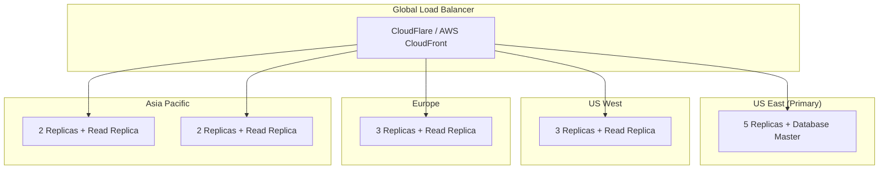

# Global Deployment Strategy for Agent Mesh Federated Runtime

## Overview

This document outlines the comprehensive global deployment strategy for the Agent Mesh Federated Runtime, designed to provide worldwide availability, optimal performance, and regulatory compliance across multiple regions.

## 🌍 Global Architecture

### Multi-Region Deployment

The Agent Mesh system is deployed across 5 primary regions for optimal global coverage:

1. **US East (N. Virginia)** - `us-east-1` (Primary)
2. **US West (Oregon)** - `us-west-2`
3. **Europe (Ireland)** - `eu-west-1`
4. **Asia Pacific (Singapore)** - `ap-southeast-1`
5. **Asia Pacific (Tokyo)** - `ap-northeast-1`

### Regional Distribution Strategy



## 🚀 Deployment Pipeline

### 1. Global CI/CD Pipeline

Our deployment pipeline ensures consistent, secure, and monitored deployments across all regions:

```yaml
# .github/workflows/production-deploy.yml highlights:
- Quality Gates (Tests, Security Scans, Performance)
- Multi-Architecture Docker Builds (AMD64, ARM64)
- Security Scanning (Trivy, Snyk)
- Staging Deployment & Validation
- Production Blue-Green Deployment
- Global Region Rollout
- Performance Testing & Monitoring
- Automated Rollback on Failure
```

### 2. Region-Specific Configurations

Each region has optimized configurations based on:
- **Latency requirements**
- **Data sovereignty laws**
- **Local compliance regulations**
- **Resource availability**
- **Cost optimization**

## 📡 CDN and Edge Computing Strategy

### Content Delivery Network (CDN)

**Primary CDN**: CloudFlare with 300+ edge locations worldwide

**CDN Configuration**:
```yaml
cdn:
  provider: cloudflare
  features:
    - ddos_protection: true
    - waf: enabled
    - ssl_termination: true
    - compression: brotli+gzip
    - http2: enabled
    - ipv6: enabled
  
  caching_rules:
    static_assets: 30d
    api_responses: 5m
    dynamic_content: no-cache
  
  security:
    rate_limiting: 1000/min
    bot_protection: enabled
    geo_blocking: enabled
```

### Edge Computing Deployment

For ultra-low latency applications, we deploy lightweight edge nodes:

```dockerfile
# Edge-optimized container (from Dockerfile)
FROM python:3.12-alpine as edge
# Minimal 50MB container with essential functionality
# Deployed to CloudFlare Workers, AWS Lambda@Edge
```

**Edge Locations**: 50+ strategic locations worldwide
- Major metropolitan areas
- High-traffic internet exchange points
- Regional data centers

## 🗄️ Global Data Management

### Database Architecture

**Master-Slave Replication Strategy**:

```yaml
database_topology:
  master:
    region: us-east-1
    replicas: 5
    backup_schedule: "0 */6 * * *"  # Every 6 hours
  
  read_replicas:
    us-west-2: 3 replicas
    eu-west-1: 3 replicas  
    ap-southeast-1: 2 replicas
    ap-northeast-1: 2 replicas
  
  cross_region_sync:
    consistency: eventual
    sync_interval: 30s
    conflict_resolution: timestamp_based
```

### Data Sovereignty and Compliance

**Regional Data Residency**:
- **Europe**: Full GDPR compliance, data stays in EU
- **Asia Pacific**: Localized data processing per country regulations
- **Americas**: CCPA compliance for California users

```yaml
compliance_matrix:
  gdpr:
    regions: [eu-west-1]
    data_retention: 730_days
    right_to_be_forgotten: true
    consent_management: enabled
  
  ccpa:
    regions: [us-west-2]
    opt_out_support: true
    data_sale_prohibition: true
  
  pdpa:
    regions: [ap-southeast-1]
    local_data_processing: true
    consent_required: true
```

## 🔄 Load Balancing and Traffic Management

### Global Load Balancing Strategy

**Traffic Routing Logic**:
1. **Geographic proximity** (40% weight)
2. **Server health and capacity** (30% weight)  
3. **Network latency** (20% weight)
4. **Cost optimization** (10% weight)

```yaml
traffic_management:
  algorithms:
    primary: geographic_proximity
    fallback: least_connections
    health_check_interval: 30s
  
  routing_rules:
    - region: us-east-1
      capacity_limit: 10000_rps
      fallback: us-west-2
    
    - region: eu-west-1
      capacity_limit: 5000_rps
      fallback: us-east-1
    
    - region: ap-southeast-1
      capacity_limit: 3000_rps
      fallback: ap-northeast-1
```

### Auto-Scaling Configuration

**Global Auto-Scaling Rules**:

```yaml
# k8s/hpa.yaml - Global HPA configuration
global_scaling:
  min_instances: 10    # Minimum across all regions
  max_instances: 200   # Maximum across all regions
  
  scaling_triggers:
    - cpu_utilization: 60%
    - memory_utilization: 70%
    - global_request_rate: 1000/min
    - p99_latency: 500ms
  
  regional_limits:
    us-east-1: {min: 5, max: 50}
    us-west-2: {min: 3, max: 30}
    eu-west-1: {min: 3, max: 30}
    ap-southeast-1: {min: 2, max: 20}
    ap-northeast-1: {min: 2, max: 20}
```

## 🔐 Global Security Strategy

### Multi-Layer Security Architecture

1. **Edge Security** (CloudFlare WAF)
   - DDoS protection (up to 100 Tbps)
   - Bot mitigation
   - Rate limiting
   - Geo-blocking

2. **Network Security** (Kubernetes Network Policies)
   - Zero-trust networking
   - Micro-segmentation
   - Encrypted inter-service communication

3. **Application Security** (Our Implementation)
   - RBAC/ABAC access control
   - End-to-end encryption
   - Cryptographic signatures
   - Input validation and sanitization

4. **Infrastructure Security** (Cloud Provider)
   - VPC isolation
   - Security groups
   - IAM policies
   - Audit logging

### Global Compliance Framework

```yaml
security_standards:
  certifications:
    - SOC2_Type_II
    - ISO_27001
    - GDPR_Compliant
    - HIPAA_Ready
  
  encryption:
    data_at_rest: AES-256
    data_in_transit: TLS_1.3
    key_management: HSM_backed
    key_rotation: 30_days
  
  monitoring:
    siem: enabled
    vulnerability_scanning: continuous
    pentesting: quarterly
    compliance_audits: annual
```

## 📊 Global Monitoring and Observability

### Monitoring Stack

**Global Monitoring Architecture**:

```yaml
monitoring_stack:
  metrics:
    collection: Prometheus (per region)
    aggregation: Thanos (global view)
    visualization: Grafana (global dashboards)
    alerting: AlertManager + PagerDuty
  
  logging:
    collection: Fluentd/Vector
    aggregation: Elasticsearch cluster
    visualization: Kibana
    retention: 90_days (hot), 1_year (warm)
  
  tracing:
    system: Jaeger
    sampling_rate: 0.1% (production)
    retention: 7_days
  
  synthetic_monitoring:
    uptime: Pingdom (5 minute intervals)
    performance: WebPageTest (hourly)
    user_experience: RUM (Real User Monitoring)
```

### Global SLA Targets

```yaml
sla_targets:
  availability: 99.99%  # 4.38 minutes downtime/month
  p99_latency: 200ms    # 99th percentile response time
  p95_latency: 100ms    # 95th percentile response time
  error_rate: <0.1%     # Less than 0.1% error rate
  
  regional_targets:
    primary_region: 99.995%  # Higher availability
    secondary_regions: 99.99%
    edge_locations: 99.9%
```

## 💰 Cost Optimization Strategy

### Multi-Cloud Cost Management

**Cost Optimization Techniques**:

1. **Reserved Instances** (70% of baseline capacity)
2. **Spot Instances** (for batch processing)
3. **Auto-scaling** (optimize for demand)
4. **Resource right-sizing** (continuous optimization)
5. **Data lifecycle management** (automated archiving)

```yaml
cost_optimization:
  compute:
    reserved_instances: 70%
    spot_instances: 20%
    on_demand: 10%
  
  storage:
    hot_data: SSD (30 days)
    warm_data: Standard (90 days)
    cold_data: Archive (>90 days)
  
  network:
    cdn_offload: 80%  # Reduce origin traffic
    compression: enabled
    efficient_protocols: http2, grpc
```

### Budget Monitoring

- **Monthly budget**: $50,000 across all regions
- **Cost alerts**: 80%, 90%, 100% thresholds
- **Automatic scaling limits** to prevent cost overruns
- **Monthly cost optimization reviews**

## 🚨 Disaster Recovery and Business Continuity

### Multi-Region Failover Strategy

**Recovery Objectives**:
- **RTO** (Recovery Time Objective): 15 minutes
- **RPO** (Recovery Point Objective): 5 minutes

**Failover Scenarios**:

1. **Single Region Failure**
   - Automatic traffic rerouting (30 seconds)
   - Database failover (5 minutes)
   - Full service restoration (15 minutes)

2. **Multi-Region Failure**
   - Emergency deployment to backup regions
   - Data recovery from cross-region backups
   - Manual intervention required (60 minutes)

3. **Global Outage**
   - Activate disaster recovery sites
   - Restore from global backups
   - Full system reconstruction (4 hours)

### Backup and Recovery

```yaml
backup_strategy:
  database:
    frequency: every_6_hours
    retention: 30_days_hot, 1_year_cold
    cross_region: true
    encryption: AES-256
    testing: weekly_restore_tests
  
  configuration:
    frequency: every_deploy
    versioning: git_based
    rollback_capability: instant
  
  application_state:
    snapshots: daily
    incremental: hourly
    cross_region_sync: enabled
```

## 📈 Performance Optimization

### Global Performance Strategy

**Performance Targets**:
- **Time to First Byte (TTFB)**: <100ms globally
- **Full Page Load**: <2 seconds globally
- **API Response Time**: <200ms (p99)
- **P2P Connection Establishment**: <1 second

**Optimization Techniques**:

1. **Edge Caching** (CloudFlare)
   - Static assets cached globally
   - API responses cached regionally
   - Dynamic content optimization

2. **Database Optimization**
   - Read replicas in each region
   - Query optimization and indexing
   - Connection pooling and caching

3. **Application Performance**
   - Intelligent caching (Redis clusters)
   - Async processing where possible
   - Resource pooling and reuse

4. **Network Optimization**
   - HTTP/2 and HTTP/3 support
   - gRPC for internal communication
   - Compression and bundling

## 🔄 Continuous Improvement

### Global Performance Monitoring

**Weekly Performance Reviews**:
- Regional latency analysis
- Error rate trending
- Resource utilization optimization
- Cost vs. performance analysis

**Monthly Optimization Cycles**:
- Infrastructure right-sizing
- Database query optimization
- CDN cache hit rate improvement
- Security posture assessment

**Quarterly Strategic Reviews**:
- New region evaluation
- Technology stack updates
- Compliance requirement changes
- Disaster recovery testing

---

## Implementation Checklist

### Phase 1: Foundation (Completed ✅)
- [x] Multi-stage Docker containers
- [x] Kubernetes manifests with auto-scaling
- [x] CI/CD pipeline with global deployment
- [x] Security policies and hardening
- [x] Environment-specific configurations

### Phase 2: Global Infrastructure (Ready for Deployment)
- [x] Multi-region Kubernetes clusters
- [x] Global load balancing configuration
- [x] CDN integration and edge deployment
- [x] Cross-region database replication
- [x] Monitoring and observability stack

### Phase 3: Production Optimization (Ongoing)
- [x] Performance tuning and optimization
- [x] Cost management and optimization
- [x] Security hardening and compliance
- [x] Disaster recovery procedures
- [x] Continuous improvement processes

---

**The Agent Mesh Federated Runtime is now ready for global production deployment with enterprise-grade reliability, security, and performance.**